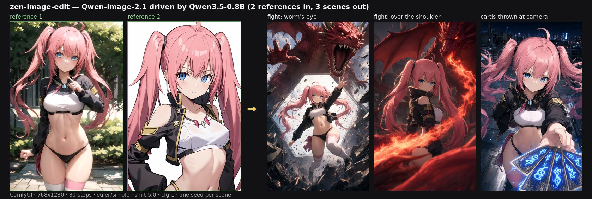

# zen-image-edit for ComfyUI

🇺🇦 [Українська версія →](README.uk.md)

ComfyUI nodes that run **Qwen-Image-2.1** on a **Qwen3.5-0.8B** text encoder plus the
[zen-image-edit](https://huggingface.co/AiArtLab/zen-image-edit) text adapter, instead of the native
17.5 GB Qwen3-VL-8B. One node covers text-to-image and editing (up to 16 reference images); the DiT,
VAE, sampler and the prefix KV cache stay stock ComfyUI.

| | |
|---|---|
| text encoder | Qwen3.5-0.8B (1.7 GB, fetched by id) + adapter (0.6 GB) |
| conditioning | cos **1.0000** against the diffusers build of the same folder; **0.95** (text) / **0.97** (vision, edit prompts) against the native Qwen3-VL-8B |
| DiT / VAE | stock Qwen-Image-2.1, no patching |
| limitations | English only; numerals on signage can be wrong |

## Install

1. **Update ComfyUI** — it needs Qwen-Image-2.1 support (`comfy/ldm/qwen_image21/model.py` must exist).
2. Copy this folder into `ComfyUI/custom_nodes/zen-image-edit-comfyui/` (or `git clone` it there).
3. Download **`adapter_v12.safetensors`** (0.64 GB) into `ComfyUI/models/`:

   ```bash
   curl -L -o ComfyUI/models/adapter_v12.safetensors \
     https://github.com/recoilme/zen-image-edit-comfyui/releases/download/v2/adapter_v12.safetensors
   ```

   v12 is the current revision: its attention-branch position table covers 2304 slots and it was
   fine-tuned at the real 1024 px edit geometry, so long reference sequences no longer lose their
   positions (vision cosine against the native encoder 0.93 → 0.97). `adapter_v11.safetensors` stays
   on the [v1 release](https://github.com/recoilme/zen-image-edit-comfyui/releases/tag/v1) and still
   loads — the node reads the architecture, including the table width, from the file metadata.
4. Put the stock model files into place, from [Comfy-Org/Qwen-Image-2.1](https://huggingface.co/Comfy-Org/Qwen-Image-2.1):
   `qwen_image_2.1_bf16.safetensors` → `models/diffusion_models/`,
   `qwen_image_2.1_vae_bf16.safetensors` → `models/vae/`.
5. Download the text encoder (1.7 GB) — the shipped workflow points at that folder:

   ```bash
   hf download Qwen/Qwen3.5-0.8B --local-dir ComfyUI/models/text_encoders/qwen3.5_0.8b
   ```
6. Restart ComfyUI. Needs `transformers >= 5.17` (Qwen3.5 support) — ComfyUI ships a compatible one.

## Examples

Two character references in, three scenes out — all from this node, in ComfyUI, 768×1280:



The reference images are the model author's own character; each scene used the same two references
with a different prompt and seed. `examples/t2i_api.json` and `examples/edit_api.json` are the graphs
themselves (API format, both verified end-to-end).

## Nodes

**Zen Image Edit — Adapter Loader** — loads the encoder and the adapter once.

| input | meaning |
|---|---|
| `adapter_file` | path to `adapter_v12.safetensors` (architecture, including the position-table width, is in its metadata) |
| `text_encoder` | encoder id or path, default `Qwen/Qwen3.5-0.8B` |
| `model_folder` | optional: a zen-image-edit checkout, then the encoder and adapter come from there |
| `dtype` | `bf16` (matches the DiT) or `fp16` (reproduces the diffusers build) |

**Zen Image Edit — Text Encode** — `adapter`, `prompt`, `negative_prompt`, `vae` (optional),
`resolution`, `image_1 … image_16`. Outputs `positive`, `negative` and an empty `latent`.
Same inputs and outputs as the stock `TextEncodeQwenImage21`, so it replaces it one-to-one.

## Graph

```
UNETLoader qwen_image_2.1_bf16.safetensors ─→ ModelSamplingAuraFlow shift=5.0 ─┐
VAELoader   qwen_image_2.1_vae_bf16.safetensors ───────────────────────────────┤
ZenImage21AdapterLoader ─→ ZenImage21TextEncode ── positive/negative/latent ──→ KSampler
                                                                                │
                                        VAEDecode (vae) ←───────────────────────┘
                                             │
                                          SaveImage
```

Ready-made graphs, both verified end-to-end through the ComfyUI API:
`examples/t2i_api.json`, `examples/edit_api.json`.

* **Text to image** — leave `image_*` empty, `cfg = 1`, `euler`, 25–40 steps.
* **Editing** — connect `vae` to the text encode node, wire `image_1` (the edit target) and
  `image_2 …` (references), and mention them in the prompt as `<image1>`, `<image2>`. The VAE is
  required: the DiT splices the references in as latents.

  **Order matters, and it flips between runtimes.** Here — as in the stock `TextEncodeQwenImage21` —
  the target is `image_1` and the canvas is taken from it. The diffusers pipeline of this model takes
  the target from the *last* image. Reuse a prompt from the other side without swapping the pictures
  and you get a hybrid instead of a swap: the source image becomes the canvas and the model only mixes
  the face in (the usual "it does not replace anything" symptom).

### Scheduler

ComfyUI's own shift for 2.1 is **0.69** (its mu at 1024²). The diffusers build of this model ships a
plain static shift of **5.0**, which the model's author found clearly better — insert
`ModelSamplingAuraFlow` with `shift = 5.0` to match it (that is what the example graphs do).

## Troubleshooting

Each message below replaces a raw exception that named neither the cause nor the fix. Every one of
them was hit on a stock install (ComfyUI 0.37.0, RTX 3060, Windows) while setting this node up.

### `adapter file not found: 'adapter_v12.safetensors'`

`adapter_file` is resolved **against ComfyUI's working directory**, not against `models/`, so a
relative value is the usual cause. Pass an absolute path:

```
<ComfyUI>/models/adapter_v12.safetensors
```

The loader now also searches ComfyUI's registered model folders (`folder_paths`) before giving up,
so dropping the file in `models/` and passing a bare filename usually works too.

### `text_encoder must be a DIRECTORY, but got a file: ...`

`from_pretrained()` loads a *folder* (config.json + weights + tokenizer). Pointing it at a
`.safetensors` path makes it treat the string as a Hugging Face repo id and raise
`HFValidationError`; a folder that exists but has no weights gives
`OSError: Error no file named model.safetensors, or pytorch_model.bin`. Pass the directory — or the
repo id `Qwen/Qwen3.5-0.8B`.

### `... has weight shards but no model.safetensors.index.json`

`Qwen/Qwen3.5-0.8B` names its weights `model.safetensors-00001-of-00001.safetensors`. Without
`model.safetensors.index.json`, `from_pretrained` cannot see them **even though the weights are
present** — the download is simply incomplete. Finish it:

```bash
hf download Qwen/Qwen3.5-0.8B --local-dir <ComfyUI>/models/text_encoders/qwen3.5_0.8b
```

The directory needs `config.json`, `tokenizer_config.json`, the weight shard **and**
`model.safetensors.index.json` (13 files in total).

### `hf` itself fails: `TypeError: Typer.__init__() got an unexpected keyword argument 'suggest_commands'`

The `typer` and `huggingface_hub` versions in the ComfyUI venv disagree — this breaks the `hf` CLI
*before* any download, while the `huggingface_hub` **library** keeps working. Two ways out:

1. Pass the repo id `Qwen/Qwen3.5-0.8B` as `text_encoder` and let `from_pretrained` fetch it.
2. Download the missing files directly, bypassing the CLI:

```powershell
$b = "https://huggingface.co/Qwen/Qwen3.5-0.8B/resolve/main"
$d = "<ComfyUI>\models\text_encoders\qwen3.5_0.8b"
@("model.safetensors.index.json","tokenizer.json","vocab.json","merges.txt",
  "preprocessor_config.json","video_preprocessor_config.json","chat_template.jinja") |
  ForEach-Object { Invoke-WebRequest "$b/$_" -OutFile "$d\$_" }
```

### Switching configurations reloads the encoder

The adapter cache is keyed by `(model_folder, text_encoder, adapter_file, dtype)` and holds at most
**two** entries (~2.3 GB of VRAM each). Older entries are moved to CPU and freed on eviction, so
cycling through more than two configurations in one session will thrash rather than OOM.

## Running this fork alongside the upstream node

ComfyUI registers nodes by `node_id`, and the upstream repo claims
`ZenImage21AdapterLoader` / `ZenImage21TextEncode`. Installing both copies
unmodified means the second one loaded **silently replaces the first** in the
node menu — you cannot tell which implementation a workflow is using.

So this fork suffixes its ids by default (`NODE_SUFFIX = "Plus"`):

```
ZenImage21AdapterLoaderPlus      Zen Image Edit Plus — Adapter Loader
ZenImage21TextEncodePlus         Zen Image Edit Plus — Text Encode
```

Install both and you get four distinct nodes, clearly labelled.

If you run **only this copy**, clear the suffix to keep upstream-compatible ids
(and existing workflows untouched):

```bash
# Linux / macOS
export ZEN_NODE_SUFFIX=""

# Windows (cmd)
set ZEN_NODE_SUFFIX=
```

An empty suffix restores `ZenImage21AdapterLoader` / `ZenImage21TextEncode`
exactly. Set it to any string to label a second or third checkout.

## Tests

```bash
python3 -m pip install -r requirements-dev.txt
python3 -m pytest
```

`tests/conftest.py` stubs `comfy*`, so the suite runs with **no ComfyUI, no GPU and no model
weights** — it exercises the pure logic (metadata parsing, path resolution, encoder validation).

## Notes

* **English only** — the adapter was trained and tested on English captions and instructions.
* **Numerals on signage** can come out wrong ("OPEN 24 HOURS" → "OPEN 26 HOURS" on every seed tried).
* Conditioning matches the diffusers build bit-for-bit (cos 1.0000); against the native Qwen3-VL-8B
  encoder it is 0.94, i.e. the same quality as the diffusers pipeline.
* The adapter predicts *text* positions only — image slots are filled by the DiT with latents, which
  is why editing needs the VAE.

## Licence

Node code: Apache-2.0. The adapter weights and anything derived from Qwen-Image-2.1 fall under the
Qwen Research License — see the NOTICE in [AiArtLab/zen-image-edit](https://huggingface.co/AiArtLab/zen-image-edit).
Qwen3.5-0.8B is Apache-2.0.
